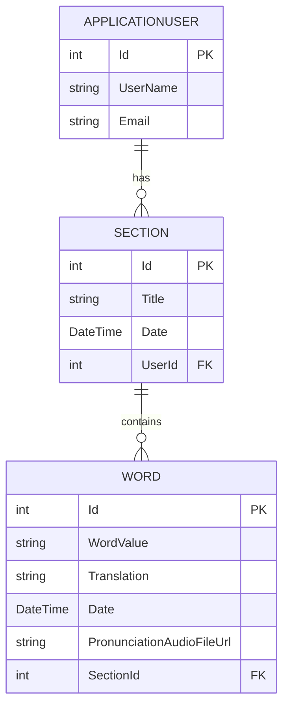

# Introduction

EnglishWordsNoteBook is a .NET 8 Web API for managing English vocabulary. It organizes words into sections, supports pronunciation uploads, and secures access with JWT. It targets learners and teams who need a fast, structured note-taking workflow.

- How it works: register or login, receive a JWT, then manage sections and words.
- Create sections, add words, search, paginate, and upload pronunciation audio.
- Why it matters: it centralizes vocabulary, enforces roles, and scales for teams. It also supports clean APIs for integrations. ✨

---

# Models

## ApplicationUser.cs

Extends IdentityUser<int> to include refresh tokens and user sections.

```csharp
public class ApplicationUser : IdentityUser<int>
{
    public string? RefreshToken { get; set; }
    public DateTime? RefreshTokenExpirationTime { get; set; }
    public virtual List<Section>? Sections { get; set; }
}
```

## Section.cs

Represents a user’s notebook section with notes and words.

```csharp
public class Section
{
    [Key] public int Id { get; set; }
    [Required] public string Title { get; set; }
    public string? Notes { get; set; }
    [Required] public DateTime Date { get; set; }
    [Required][ForeignKey("User")] public int UserId { get; set; }
    public virtual ApplicationUser User { get; set; }
    public virtual List<Word>? Words { get; set; }
}
```

## Word.cs

Stores English words, translations, pronunciation URL, and section link.

```csharp
public class Word
{
    [Key] public int Id { get; set; }
    [Required] public string WordValue { get; set; }
    [Required] public string Translation { get; set; }
    [Required] public DateTime Date { get; set; }
    public string? PronunciationAudioFileUrl { get; set; }
    [Required][ForeignKey("Section")] public int SectionId { get; set; }
    public virtual Section Section { get; set; }
}
```

## DatabaseContext.cs

EF Core context with Identity tables, Sections, Words, default Date column values, and unique email index.

```csharp
public class DatabaseContext : IdentityDbContext<ApplicationUser, IdentityRole<int>, int>
{
    public DbSet<Section> Sections { get; set; }
    public DbSet<Word> Words { get; set; }

    protected override void OnModelCreating(ModelBuilder builder)
    {
        builder.Entity<Word>()
            .Property<DateTime>(w => w.Date)
            .HasDefaultValueSql("GETDATE()");
        builder.Entity<Section>()
            .Property<DateTime>(s => s.Date)
            .HasDefaultValueSql("GETDATE()");
        builder.Entity<ApplicationUser>()
            .HasIndex(u => u.NormalizedEmail)
            .IsUnique();
        base.OnModelCreating(builder);
    }
}
```

### Entity Relationship Diagram



---

# Migrations

Three migrations manage schema changes:

| File                                                    | Purpose                                                           |
| ------------------------------------------------------- | ----------------------------------------------------------------- |
| 20250908022119_create_db.cs                             | Creates AspNet tables, Sections, Words and relations              |
| 20251001162132_add_date_column_and_its_default_value.cs | Adds Date column to Words with GETDATE(), updates Sections date   |
| 20251008042902_make_email_in_user_table_unique.cs       | Alters Section.Title, makes NormalizedEmail unique in AspNetUsers |

Designer and snapshot files auto-generate EF Core model metadata.

---

# Repositories

## IRepository.cs

Generic CRUD interface and paging/count by user.

## ISectionRepository.cs

Inherits IRepository<Section>.

## IWordRepository.cs

Extends IRepository<Word> with section filtering, substring search, pronunciation updates.

## SectionRepository.cs

Implements section data operations using DatabaseContext.

## WordRepository.cs

Implements word data operations with EF Core, handles errors, and pronunciation URL updates.

---

# Services

## IAuthService.cs & AuthService.cs

Handles user registration, login, logout, and token refresh using UserManager, SignInManager, and IJwtService.

## IJwtService.cs & JwtService.cs

Generates JWT access tokens with roles, and secure random refresh tokens.

## IUserService.cs & UserService.cs

Manages admin-level user CRUD and password changes.

## ISectionService.cs & SectionService.cs

Manages section CRUD, paging, counting, and user-based retrieval.

## IWordService.cs & WordService.cs

Manages word CRUD, paging, counting, user/section filters, search, pronunciation upload, and validation.

---

# DTOs and Helpers

| File                       | Description                                                    |
| -------------------------- | -------------------------------------------------------------- |
| RoleNames.cs               | Holds `Admin` and `User` role strings.                         |
| HttpStatusCodeException.cs | Custom exception with HTTP status code.                        |
| GeneralResponse.cs         | Standard API response wrapper: Success, Message, Data, Errors. |
| GetPageDTO.cs              | PageNum and ItemsPerPage with validation.                      |
| AddSectionDTO.cs           | Title and optional notes for creating a section.               |
| UpdateSectionDTO.cs        | Title and optional notes for updating a section.               |
| ReturnSectionDTO.cs        | ID, Title, Notes, Date returned after section operations.      |
| AddWordDTO.cs              | WordValue, Translation, SectionId, optional audio URL.         |
| UpdateWordDTO.cs           | WordValue, Translation, SectionId for updates.                 |
| ReturnWordDTO.cs           | ID, WordValue, Translation, Date, audio URL, SectionId.        |
| UploadPronounciationDTO.cs | IFormFile for audio upload.                                    |
| AddUserDTO.cs              | Username, Email, Password, RoleName for registration.          |
| LoginUserDTO.cs            | Email and Password for login.                                  |
| ReturnedUserDTO.cs         | ID, Username, Email returned after user operations.            |
| ReturnAuthDTO.cs           | Success, Message, TokensDTO after auth operations.             |
| TokensDTO.cs               | AccessToken, RefreshToken, RefreshTokenExpirationTime.         |
| UpdateUserDTO.cs           | ID, Username, Email, old and new passwords.                    |

---

# Middleware

## GlobalExceptionMiddleware.cs

Catches all unhandled exceptions, logs them, and returns a JSON `GeneralResponse` with appropriate status code.

```csharp
public class GlobalExceptionMiddleware
{
    public async Task InvokeAsync(HttpContext context)
    {
        try { await _next(context); }
        catch (Exception ex)
        {
            _logger.LogError(ex, ex.Message);
            await HandleExceptionAsync(context, ex);
        }
    }
    private static Task HandleExceptionAsync(HttpContext ctx, Exception ex)
    {
        var resp = new GeneralResponse {
            Success = false, Message = ex.Message, Data = null, Errors = null
        };
        ctx.Response.StatusCode = ex is HttpStatusCodeException h ? h.StatusCode : 500;
        ctx.Response.ContentType = "application/json";
        return ctx.Response.WriteAsJsonAsync(resp);
    }
}
```

---

# Controllers & API Endpoints

Base URL: **http://localhost:5151/api**  
All endpoints return a `GeneralResponse` wrapper unless noted.  
Endpoints marked `[Authorize]` require `Authorization: Bearer <token>` header.

---

## AuthController

Handles user registration, login, logout, and token refresh.

### POST /Auth/Register

Creates a new user with assigned role.

```api
{
  "title": "Register",
  "description": "Register a new user account.",
  "method": "POST",
  "baseUrl": "http://localhost:5151/api",
  "endpoint": "/Auth/Register",
  "headers": [
    { "key": "Content-Type", "value": "application/json", "required": true }
  ],
  "pathParams": [],
  "queryParams": [],
  "bodyType": "json",
  "requestBody": "{\"username\":\"jdoe\",\"email\":\"john@example.com\",\"password\":\"P@ssw0rd!\",\"roleName\":\"User\"}",
  "responses": {
    "200": {
      "description": "User registered successfully.",
      "body": "{\"success\":true,\"message\":\"User Register Successfully\",\"data\":null,\"errors\":null}"
    },
    "400": {
      "description": "Validation failed.",
      "body": "{\"success\":false,\"message\":\"Password must be ...\",\"data\":null,\"errors\":null}"
    }
  }
}
```

---

### POST /Auth/Login

Authenticates user and issues access & refresh tokens. Sets `refreshToken` cookie.

```api
{
  "title": "Login",
  "description": "Authenticate user and get JWT tokens.",
  "method": "POST",
  "baseUrl": "http://localhost:5151/api",
  "endpoint": "/Auth/Login",
  "headers": [
    { "key": "Content-Type", "value": "application/json", "required": true }
  ],
  "pathParams": [],
  "queryParams": [],
  "bodyType": "json",
  "requestBody": "{\"email\":\"john@example.com\",\"password\":\"P@ssw0rd!\"}",
  "responses": {
    "200": {
      "description": "Login successful, sets refreshToken cookie.",
      "body": "{\"success\":true,\"message\":\"User Login Successfully\",\"data\":{\"accessToken\":\"<jwt>\"},\"errors\":null}"
    },
    "401": {
      "description": "Invalid credentials.",
      "body": "{\"success\":false,\"message\":\"Password Is Incorrect\",\"data\":null,\"errors\":null}"
    }
  }
}
```

---

### POST /Auth/Logout

Revokes refresh token and clears cookie.

```api
{
  "title": "Logout",
  "description": "Revoke tokens and clear refresh cookie.",
  "method": "POST",
  "baseUrl": "http://localhost:5151/api",
  "endpoint": "/Auth/Logout",
  "headers": [
    { "key": "Authorization", "value": "Bearer <accessToken>", "required": true }
  ],
  "pathParams": [],
  "queryParams": [],
  "bodyType": "none",
  "requestBody": "",
  "responses": {
    "204": {
      "description": "Logout successful (No Content).",
      "body": ""
    },
    "401": {
      "description": "Unauthorized or missing token.",
      "body": "{\"success\":false,\"message\":\"Unauthorized\",\"data\":null,\"errors\":null}"
    }
  }
}
```

---

### POST /Auth/Refresh

Issues new access and refresh tokens.

```api
{
  "title": "Refresh Tokens",
  "description": "Refresh JWT using valid refreshToken cookie.",
  "method": "POST",
  "baseUrl": "http://localhost:5151/api",
  "endpoint": "/Auth/Refresh",
  "headers": [
    { "key": "Cookie", "value": "refreshToken=<token>", "required": true }
  ],
  "pathParams": [],
  "queryParams": [],
  "bodyType": "none",
  "requestBody": "",
  "responses": {
    "200": {
      "description": "Tokens refreshed, sets new cookie.",
      "body": "{\"success\":true,\"message\":\"Tokens Refreshed Successfully\",\"data\":{\"accessToken\":\"<jwt>\"},\"errors\":null}"
    },
    "401": {
      "description": "Invalid or expired refresh token.",
      "body": "{\"success\":false,\"message\":\"Invalid Or Expired Refresh Token\",\"data\":null,\"errors\":null}"
    }
  }
}
```

---

## WordController

Manages CRUD and queries for words. All routes require `Authorization: Bearer <token>`.

### GET /Word/{Id}

Retrieve a word by ID.

```api
{
  "title": "Get Word by ID",
  "description": "Fetch a single word record.",
  "method": "GET",
  "baseUrl": "http://localhost:5151/api",
  "endpoint": "/Word/{Id}",
  "headers": [
    { "key": "Authorization", "value": "Bearer <token>", "required": true }
  ],
  "pathParams": [
    { "key": "Id", "value": "Word ID", "required": true }
  ],
  "queryParams": [],
  "bodyType": "none",
  "requestBody": "",
  "responses": {
    "200": {
      "description": "Word returned successfully.",
      "body": "{\"success\":true,\"message\":\"Word have been received successfully\",\"data\":{\"id\":1,\"wordValue\":\"hello\",\"translation\":\"hola\",\"date\":\"2025-10-15T12:34:56\",\"pronunciationAudioFileUrl\":null,\"sectionId\":2},\"errors\":null}"
    },
    "404": {
      "description": "Word not found.",
      "body": "{\"success\":false,\"message\":\"There is no word with this id\",\"data\":null,\"errors\":null}"
    }
  }
}
```

---

### POST /Word

Create a new word entry.

```api
{
  "title": "Add Word",
  "description": "Create a new word under a section.",
  "method": "POST",
  "baseUrl": "http://localhost:5151/api",
  "endpoint": "/Word",
  "headers": [
    { "key": "Authorization", "value": "Bearer <token>", "required": true },
    { "key": "Content-Type", "value": "application/json", "required": true }
  ],
  "pathParams": [],
  "queryParams": [],
  "bodyType": "json",
  "requestBody": "{\"wordValue\":\"hello\",\"translation\":\"hola\",\"sectionId\":2}",
  "responses": {
    "201": {
      "description": "Word created successfully.",
      "body": "{\"success\":true,\"message\":\"Word have been created successfully\",\"data\":{\"id\":5,\"wordValue\":\"hello\",\"translation\":\"hola\",\"date\":\"2025-10-15T12:50:00\",\"pronunciationAudioFileUrl\":null,\"sectionId\":2},\"errors\":null}"
    },
    "400": {
      "description": "Validation or save error.",
      "body": "{\"success\":false,\"message\":\"SectionId Can't be less than 1\",\"data\":null,\"errors\":null}"
    }
  }
}
```

---

### PUT /Word/{Id}

Update an existing word.

```api
{
  "title": "Update Word",
  "description": "Modify a word’s data.",
  "method": "PUT",
  "baseUrl": "http://localhost:5151/api",
  "endpoint": "/Word/{Id}",
  "headers": [
    { "key": "Authorization", "value": "Bearer <token>", "required": true },
    { "key": "Content-Type", "value": "application/json", "required": true }
  ],
  "pathParams": [
    { "key": "Id", "value": "Word ID", "required": true }
  ],
  "queryParams": [],
  "bodyType": "json",
  "requestBody": "{\"wordValue\":\"hi\",\"translation\":\"hola\",\"sectionId\":2}",
  "responses": {
    "200": {
      "description": "Word updated successfully.",
      "body": "{\"success\":true,\"message\":\"Word have been updated successfully\",\"data\":{\"id\":1,\"wordValue\":\"hi\",\"translation\":\"hola\",\"date\":\"2025-10-15T12:34:56\",\"pronunciationAudioFileUrl\":null,\"sectionId\":2},\"errors\":null}"
    },
    "404": {
      "description": "Word not found.",
      "body": "{\"success\":false,\"message\":\"There is no word with this id\",\"data\":null,\"errors\":null}"
    }
  }
}
```

---

### DELETE /Word/{Id}

Delete a word.

```api
{
  "title": "Delete Word",
  "description": "Remove a word by its ID.",
  "method": "DELETE",
  "baseUrl": "http://localhost:5151/api",
  "endpoint": "/Word/{Id}",
  "headers": [
    { "key": "Authorization", "value": "Bearer <token>", "required": true }
  ],
  "pathParams": [
    { "key": "Id", "value": "Word ID", "required": true }
  ],
  "queryParams": [],
  "bodyType": "none",
  "requestBody": "",
  "responses": {
    "204": {
      "description": "Word deleted (No Content).",
      "body": ""
    },
    "400": {
      "description": "Delete failed.",
      "body": "{\"success\":false,\"message\":\"There is a problem happend while deleting a word\",\"data\":null,\"errors\":null}"
    }
  }
}
```

---

### GET /Word

List all words for the authenticated user.

```api
{
  "title": "Get All Words",
  "description": "Retrieve all words for current user.",
  "method": "GET",
  "baseUrl": "http://localhost:5151/api",
  "endpoint": "/Word",
  "headers": [
    { "key": "Authorization", "value": "Bearer <token>", "required": true }
  ],
  "pathParams": [],
  "queryParams": [],
  "bodyType": "none",
  "requestBody": "",
  "responses": {
    "200": {
      "description": "List of words.",
      "body": "{\"success\":true,\"message\":\"Words have been recieved successfully\",\"data\":[{...}],\"errors\":null}"
    }
  }
}
```

---

### GET /Word/Count

Count words for the authenticated user.

```api
{
  "title": "Count Words",
  "description": "Get total word count for current user.",
  "method": "GET",
  "baseUrl": "http://localhost:5151/api",
  "endpoint": "/Word/Count",
  "headers": [
    { "key": "Authorization", "value": "Bearer <token>", "required": true }
  ],
  "responses": {
    "200": {
      "description": "Total count returned.",
      "body": "{\"success\":true,\"message\":\"Words have been counted successfully\",\"data\":42,\"errors\":null}"
    }
  }
}
```

---

### GET /Word/Page

Get a paged list of words.

```api
{
  "title": "Paged Words",
  "description": "Retrieve paged words for user.",
  "method": "GET",
  "baseUrl": "http://localhost:5151/api",
  "endpoint": "/Word/Page",
  "headers": [
    { "key": "Authorization", "value": "Bearer <token>", "required": true }
  ],
  "queryParams": [
    { "key": "PageNum", "value": "1", "required": true },
    { "key": "ItemsPerPage", "value": "10", "required": true }
  ],
  "bodyType": "none",
  "responses": {
    "200": {
      "description": "Paged words list.",
      "body": "{\"success\":true,\"message\":\"Words have been received successfully\",\"data\":[...],\"errors\":null}"
    }
  }
}
```

---

### GET /Word/Section/{Id}

List words by section.

```api
{
  "title": "Words by Section",
  "description": "Fetch words under a specific section.",
  "method": "GET",
  "baseUrl": "http://localhost:5151/api",
  "endpoint": "/Word/Section/{Id}",
  "headers": [
    { "key": "Authorization", "value": "Bearer <token>", "required": true }
  ],
  "pathParams": [
    { "key": "Id", "value": "Section ID", "required": true }
  ],
  "responses": {
    "200": {
      "description": "Words returned.",
      "body": "{\"success\":true,\"message\":\"Words have been received successfully\",\"data\":[...],\"errors\":null}"
    }
  }
}
```

---

### GET /Word/Section/{Id}/Count

Count words in a section.

```api
{
  "title": "Count Words by Section",
  "description": "Get word count for a section.",
  "method": "GET",
  "baseUrl": "http://localhost:5151/api",
  "endpoint": "/Word/Section/{Id}/Count",
  "headers": [
    { "key": "Authorization", "value": "Bearer <token>", "required": true }
  ],
  "pathParams": [
    { "key": "Id", "value": "Section ID", "required": true }
  ],
  "responses": {
    "200": {
      "description": "Section word count.",
      "body": "{\"success\":true,\"message\":\"Words have been counted successfully\",\"data\":15,\"errors\":null}"
    }
  }
}
```

---

### GET /Word/Search

Search words by substring.

```api
{
  "title": "Search Words",
  "description": "Find words containing a substring.",
  "method": "GET",
  "baseUrl": "http://localhost:5151/api",
  "endpoint": "/Word/Search",
  "headers": [
    { "key": "Authorization", "value": "Bearer <token>", "required": true }
  ],
  "queryParams": [
    { "key": "WordPart", "value": "hel", "required": true }
  ],
  "responses": {
    "200": {
      "description": "Matched words returned.",
      "body": "{\"success\":true,\"message\":\"There Are Words Found\",\"data\":[...],\"errors\":null}"
    }
  }
}
```

---

### GET /Word/NoPronunciation

List words missing audio.

```api
{
  "title": "Words Without Audio",
  "description": "Retrieve words without pronunciation file.",
  "method": "GET",
  "baseUrl": "http://localhost:5151/api",
  "endpoint": "/Word/NoPronunciation",
  "headers": [
    { "key": "Authorization", "value": "Bearer <token>", "required": true }
  ],
  "responses": {
    "200": {
      "description": "List of words missing audio.",
      "body": "{\"success\":true,\"message\":\"There Are Words Found\",\"data\":[...],\"errors\":null}"
    }
  }
}
```

---

### POST /Word/{Id}/Upload-Pronunciation

Upload audio file for a word’s pronunciation.

```api
{
  "title": "Upload Pronunciation",
  "description": "Attach audio file to a word.",
  "method": "POST",
  "baseUrl": "http://localhost:5151/api",
  "endpoint": "/Word/{Id}/Upload-Pronunciation",
  "headers": [
    { "key": "Authorization", "value": "Bearer <token>", "required": true }
  ],
  "pathParams": [
    { "key": "Id", "value": "Word ID", "required": true }
  ],
  "bodyType": "form",
  "formData": [
    { "key": "PronounciationAudioFile", "value": "audio.mp3", "required": true }
  ],
  "responses": {
    "200": {
      "description": "Audio URL returned.",
      "body": "{\"success\":true,\"message\":\"Audio saved successfully\",\"data\":\"/Audio/WordPronounciations/xyz.mp3\",\"errors\":null}"
    },
    "400": {
      "description": "Upload failed.",
      "body": "{\"success\":false,\"message\":\"Audio was not saved successfully\",\"data\":null,\"errors\":null}"
    }
  }
}
```

---

## SectionController

CRUD and queries for sections. Requires `Admin` or `User` role.  
`GET /Section/All` requires `Admin`.

### POST /Section

Create a new section.

```api
{
  "title": "Create Section",
  "description": "Add a new section to your notebook.",
  "method": "POST",
  "baseUrl": "http://localhost:5151/api",
  "endpoint": "/Section",
  "headers": [
    { "key": "Authorization", "value": "Bearer <token>", "required": true },
    { "key": "Content-Type", "value": "application/json", "required": true }
  ],
  "bodyType": "json",
  "requestBody": "{\"title\":\"Daily Vocabulary\",\"notes\":\"Focus on verbs.\"}",
  "responses": {
    "201": {
      "description": "Section created.",
      "body": "{\"success\":true,\"message\":\"Section have been created successfully\",\"data\":{\"id\":3,\"title\":\"Daily Vocabulary\",\"notes\":\"Focus on verbs.\",\"date\":\"2025-10-15T13:00:00\"},\"errors\":null}"
    }
  }
}
```

---

### PUT /Section/{Id}

Update a section.

```api
{
  "title": "Update Section",
  "description": "Modify section title or notes.",
  "method": "PUT",
  "baseUrl": "http://localhost:5151/api",
  "endpoint": "/Section/{Id}",
  "headers": [
    { "key": "Authorization", "value": "Bearer <token>", "required": true },
    { "key": "Content-Type", "value": "application/json", "required": true }
  ],
  "pathParams": [
    { "key": "Id", "value": "Section ID", "required": true }
  ],
  "requestBody": "{\"title\":\"Updated Title\",\"notes\":\"Revised notes.\"}",
  "responses": {
    "200": {
      "description": "Section updated.",
      "body": "{\"success\":true,\"message\":\"Section have been Updated successfully\",\"data\":{\"id\":3,\"title\":\"Updated Title\",\"notes\":\"Revised notes.\",\"date\":\"2025-10-15T13:00:00\"},\"errors\":null}"
    }
  }
}
```

---

### DELETE /Section/{Id}

Delete a section.

```api
{
  "title": "Delete Section",
  "description": "Remove a section by ID.",
  "method": "DELETE",
  "baseUrl": "http://localhost:5151/api",
  "endpoint": "/Section/{Id}",
  "headers": [
    { "key": "Authorization", "value": "Bearer <token>", "required": true }
  ],
  "pathParams": [
    { "key": "Id", "value": "Section ID", "required": true }
  ],
  "responses": {
    "200": {
      "description": "Deletion result.",
      "body": "{\"success\":true,\"message\":\"Section have been Deleted successfully\",\"data\":null,\"errors\":null}"
    }
  }
}
```

---

### GET /Section/{Id}

Fetch a single section.

```api
{
  "title": "Get Section by ID",
  "description": "Retrieve section details.",
  "method": "GET",
  "baseUrl": "http://localhost:5151/api",
  "endpoint": "/Section/{Id}",
  "headers": [
    { "key": "Authorization", "value": "Bearer <token>", "required": true }
  ],
  "pathParams": [
    { "key": "Id", "value": "Section ID", "required": true }
  ],
  "responses": {
    "200": {
      "description": "Section data returned.",
      "body": "{\"success\":true,\"message\":\"Section have been received successfully\",\"data\":{\"id\":3,\"title\":\"Daily Vocabulary\",\"notes\":\"Focus on verbs.\",\"date\":\"2025-10-15T13:00:00\"},\"errors\":null}"
    }
  }
}
```

---

### GET /Section/Count

Count sections for user.

```api
{
  "title": "Count Sections",
  "description": "Get total sections for current user.",
  "method": "GET",
  "baseUrl": "http://localhost:5151/api",
  "endpoint": "/Section/Count",
  "headers": [
    { "key": "Authorization", "value": "Bearer <token>", "required": true }
  ],
  "responses": {
    "200": {
      "description": "Total sections count.",
      "body": "{\"success\":true,\"message\":\"Request Done Successfully\",\"data\":5,\"errors\":null}"
    }
  }
}
```

---

### GET /Section/Page

Get paged sections.

```api
{
  "title": "Paged Sections",
  "description": "Retrieve paged sections for user.",
  "method": "GET",
  "baseUrl": "http://localhost:5151/api",
  "endpoint": "/Section/Page",
  "headers": [
    { "key": "Authorization", "value": "Bearer <token>", "required": true }
  ],
  "queryParams": [
    { "key": "PageNum", "value": "1", "required": true },
    { "key": "ItemsPerPage", "value": "10", "required": true }
  ],
  "responses": {
    "200": {
      "description": "Paged sections list.",
      "body": "{\"success\":true,\"message\":\"Sections have been received successfully\",\"data\":[...],\"errors\":null}"
    }
  }
}
```

---

### GET /Section

List all sections for user.

```api
{
  "title": "Get My Sections",
  "description": "Fetch all sections of current user.",
  "method": "GET",
  "baseUrl": "http://localhost:5151/api",
  "endpoint": "/Section",
  "headers": [
    { "key": "Authorization", "value": "Bearer <token>", "required": true }
  ],
  "responses": {
    "200": {
      "description": "User’s sections.",
      "body": "{\"success\":true,\"message\":\"Sections have been received successfully\",\"data\":[...],\"errors\":null}"
    }
  }
}
```

---

### GET /Section/All

List all sections (Admin only).

```api
{
  "title": "Get All Sections",
  "description": "Admin: retrieve all sections across users.",
  "method": "GET",
  "baseUrl": "http://localhost:5151/api",
  "endpoint": "/Section/All",
  "headers": [
    { "key": "Authorization", "value": "Bearer <token-with-admin-role>", "required": true }
  ],
  "responses": {
    "200": {
      "description": "All sections returned.",
      "body": "{\"success\":true,\"message\":\"Sections have been received successfully\",\"data\":[...],\"errors\":null}"
    },
    "403": {
      "description": "Forbidden for non-admin.",
      "body": "{\"success\":false,\"message\":\"Forbidden\",\"data\":null,\"errors\":null}"
    }
  }
}
```

---

## UserController

Admin-only user management (create, update, delete).

### POST /User

Create a new user (Admin-only).

```api
{
  "title": "Add User",
  "description": "Admin: add a new user account.",
  "method": "POST",
  "baseUrl": "http://localhost:5151/api",
  "endpoint": "/User",
  "headers": [
    { "key": "Authorization", "value": "Bearer <adminToken>", "required": true },
    { "key": "Content-Type", "value": "application/json", "required": true }
  ],
  "requestBody": "{\"username\":\"alice\",\"email\":\"alice@example.com\",\"password\":\"Str0ngP@ss!\",\"roleName\":\"User\"}",
  "responses": {
    "200": {
      "description": "User added successfully.",
      "body": "{\"success\":true,\"message\":\"Added Successfully\",\"data\":{\"id\":7,\"username\":\"alice\",\"email\":\"alice@example.com\"},\"errors\":null}"
    }
  }
}
```

---

### PUT /User

Update an existing user.

```api
{
  "title": "Update User",
  "description": "Admin: update user details and password.",
  "method": "PUT",
  "baseUrl": "http://localhost:5151/api",
  "endpoint": "/User",
  "headers": [
    { "key": "Authorization", "value": "Bearer <adminToken>", "required": true },
    { "key": "Content-Type", "value": "application/json", "required": true }
  ],
  "requestBody": "{\"id\":7,\"username\":\"alice2\",\"email\":\"alice2@example.com\",\"password\":\"OldP@ss!\",\"newPassword\":\"NewP@ss!\"}",
  "responses": {
    "200": {
      "description": "User updated.",
      "body": "{\"success\":true,\"message\":\"Updated Successfully\",\"data\":{\"id\":7,\"username\":\"alice2\",\"email\":\"alice2@example.com\"},\"errors\":null}"
    },
    "404": {
      "description": "User not found.",
      "body": "{\"success\":false,\"message\":\"There is no user with this id\",\"data\":null,\"errors\":null}"
    }
  }
}
```

---

### DELETE /User/{Id}

Delete a user (Admin-only). Cannot delete self.

```api
{
  "title": "Delete User",
  "description": "Admin: remove a user by ID.",
  "method": "DELETE",
  "baseUrl": "http://localhost:5151/api",
  "endpoint": "/User/{Id}",
  "headers": [
    { "key": "Authorization", "value": "Bearer <adminToken>", "required": true }
  ],
  "pathParams": [
    { "key": "Id", "value": "User ID", "required": true }
  ],
  "responses": {
    "200": {
      "description": "User deleted successfully.",
      "body": "{\"success\":true,\"message\":\"Deleted Successfully\",\"data\":null,\"errors\":null}"
    },
    "400": {
      "description": "Cannot delete self.",
      "body": "{\"success\":false,\"message\":\"You Can't Delete Yourself\",\"data\":null,\"errors\":null}"
    }
  }
}
```
